# PersonaPlex MBG

**PersonaPlex MBG** is a research extension of [NVIDIA PersonaPlex](https://github.com/NVIDIA/personaplex) that augments the full-duplex conversational speech model with two additional generative modules: a **Backchannel / Voice Activity Prediction (VAP)** module and a **3DMM face motion generation** module. The base architecture and weights follow PersonaPlex 7B, which itself is built on [Moshi](https://arxiv.org/abs/2410.00037).

> **Original repository:** [NVIDIA/personaplex](https://github.com/NVIDIA/personaplex)  
> **Original paper:** [PersonaPlex: Voice and Role Control for Full Duplex Conversational Speech Models](https://research.nvidia.com/labs/adlr/files/personaplex/personaplex_preprint.pdf)  
> **Base weights:** [`nvidia/personaplex-7b-v1`](https://huggingface.co/nvidia/personaplex-7b-v1)

---

## Architecture Diagram

> Render with any Mermaid-compatible viewer (GitHub, VS Code Mermaid Preview, etc.)

```mermaid
flowchart TD

    %% ═══════════════════════════════════════════════════════
    %% INPUTS
    %% ═══════════════════════════════════════════════════════
    UAUD["User Audio\n24 kHz WAV"]
    AAUD["Agent Audio\n24 kHz WAV"]
    TTOK["Text Input\nSentencePiece Tokens"]

    %% ═══════════════════════════════════════════════════════
    %% MIMI ENCODER
    %% ═══════════════════════════════════════════════════════
    MIMI["Mimi Audio Encoder\n24kHz to 12.5fps\n8 VQ codebooks per channel"]
    UAUD & AAUD --> MIMI
    MIMI --> ACODES["Audio Codes  B x K16 x T\n8 user-ch + 8 agent-ch codebooks"]
    TTOK --> TCODES["Text Codes  B x 1 x T"]

    %% ═══════════════════════════════════════════════════════
    %% PERSONAPLEX BACKBONE  (simplified)
    %% ═══════════════════════════════════════════════════════
    subgraph BB["PERSONAPLEX BACKBONE  simplified"]
        BBIN["Token Embeddings\ntext_emb  +  16 x audio_emb per codebook"]
        BBHEL["Helium Transformer\n24 causal layers  dim=4096\nGQA  RMSNorm  RoPE  dep_q=16"]
        BBZS["z_s   B x T x 4096\nBackbone hidden states  12.5 fps"]
        BBIN --> BBHEL --> BBZS
    end
    ACODES & TCODES --> BBIN

    %% ═══════════════════════════════════════════════════════
    %% VAP MODULE ROUTING
    %% ═══════════════════════════════════════════════════════
    BBZS --> VTYPE{{"VAP module_type\nmlp  or  vap_gpt"}}

    %% ╔═══════════════════════════════════════════════════════╗
    %% ║  MLP VARIANT  BackchannelModule                       ║
    %% ╚═══════════════════════════════════════════════════════╝
    subgraph MLPMOD["BackchannelModule   module_type = mlp"]
        direction TB

        MLPI["input  z_s   B x T x 4096"]

        subgraph VMP["Step 2  VAP MLP   z_s to z_vap"]
            VM1["Linear 4096 to 512"]
            VMR["ReLU"]
            VM2["Linear 512 to 256"]
            VM1 --> VMR --> VM2
        end
        MLPI --> VM1
        VM2 --> ZVAP["z_vap   B x T x 256\nVAP logits  used for CE loss"]

        subgraph BCM["Step 3  BC MLP   concat to z_bc"]
            BCAT["concat z_vap and z_s   B x T x 4352"]
            BC1["Linear 4352 to 512"]
            BCR["ReLU"]
            BC2["Linear 512 to 2"]
            BCAT --> BC1 --> BCR --> BC2
        end
        ZVAP --> BCAT
        MLPI --> BCAT
        BC2 --> ZBCM["z_bc   B x T x 2\nlogit_PAD   logit_EPAD"]

        subgraph GSM["Step 4  Gumbel-Softmax ST   z_bc to y_bc"]
            GN["Add Gumbel noise\ng = -log -log U   U ~ Uniform 0 1"]
            GT["Scale by 1 over temp\ntemp = max 0.5   1.0 x exp -0.0001 x step\nExponential annealing from 1.0 to 0.5"]
            GS["Softmax  y_soft   B x T x 2"]
            GH["Hard argmax  y_hard  one-hot\nStraight-Through grad:\ny = y_hard - y_soft.detach + y_soft"]
            YBCM["y_bc = y_hard index 1   B x T\n1 = insert EPAD  backchannel token\n0 = insert PAD   silence token"]
            GN --> GT --> GS --> GH --> YBCM
        end
        ZBCM --> GN

        subgraph SGM["Step 5  Silence Gate MLP   z_s to s_pad"]
            SGD["z_s.detach\nno gradient flows back to Helium backbone\ngate is trained only by commitment loss"]
            SG1["Linear 4096 to 256"]
            SGR["ReLU"]
            SG2["Linear 256 to 2"]
            SGLOG["silence_gate_logits   B x T x 2\nindex 0 = speaking   index 1 = silence"]
            SGGS["Gumbel-Softmax ST\nsame temperature schedule as y_bc"]
            SPADM["s_pad   B x T\n1 = model about to emit PAD\n0 = model actively speaking"]
            SGD --> SG1 --> SGR --> SG2 --> SGLOG --> SGGS --> SPADM
        end
        MLPI --> SGD

        subgraph GFM_SUB["Step 6  Final Gate and BC Embedding"]
            GFMN["g_final = s_pad x y_bc   B x T\nBackchannel inserted ONLY when BOTH fire\n  y_bc = 1  BC MLP votes EPAD\n  s_pad = 1  Silence gate votes silence\nDouble-gating prevents spurious insertions"]
            EBIM["bc_token_emb   B x T x depformer_dim\n= y_bc x Embed EPAD  +  1-y_bc x Embed PAD\nDifferentiable soft interpolation\nvia Straight-Through y_bc gradient"]
        end
        YBCM & SPADM --> GFMN
        YBCM --> EBIM
    end
    VTYPE -- "mlp" --> MLPI

    %% ╔═══════════════════════════════════════════════════════╗
    %% ║  VapGPT VARIANT  VapGPTBackchannelModule              ║
    %% ╚═══════════════════════════════════════════════════════╝
    subgraph GPTMOD["VapGPTBackchannelModule   module_type = vap_gpt"]
        direction TB

        GPTI["input  z_s   B x T x 4096"]

        subgraph GPRJ["Step 1  Dual Projection   pseudo-speaker streams"]
            PU["proj_user   Linear 4096 to 256  no bias\ntrained from scratch"]
            PA["proj_agent  Linear 4096 to 256  no bias\ntrained from scratch"]
            XU["x_user   B x T x 256\nUser-side pseudo stream"]
            XA["x_agent  B x T x 256\nAgent-side pseudo stream"]
            PU --> XU
            PA --> XA
        end
        GPTI --> PU & PA

        subgraph GARC["Step 2  Per-Stream GPT   ar_channel   shared weights"]
            ARC["GPT   1 layer  dim=256  4 heads\nAliBI positional bias  no fixed max length\nCausal self-attention  pre-LN  GELU FFN\nIDENTICAL weights applied to BOTH streams separately"]
            HU["h_user   B x T x 256"]
            HA["h_agent  B x T x 256"]
        end
        XU & XA --> ARC
        ARC --> HU & HA

        subgraph GSTER["Step 3  Cross-Stream GPTStereo   ar   3 layers"]
            direction TB
            STL["TransformerStereoLayer x 3\n  Self-Attn AliBI causal on own stream\n  Cross-Attn AliBI  Q=own  KV=other stream\n  pre-LayerNorm  GELU FFN  Dropout\n  Applied symmetrically to both streams"]
            CMB["Combinator\nha = GELU LN linear_a x1\nhb = GELU LN linear_b x2\nx_combined = ha + hb\nchannel-aware fusion of both towers"]
            XCMB["x_combined   B x T x 256\nGlobal turn-taking context\nused for VAP head and silence gate"]
            XA2["x2_agent   B x T x 256\nAgent-side output after cross-attention\nused for BC gate decision"]
        end
        HU & HA --> STL
        STL --> CMB --> XCMB
        STL --> XA2

        subgraph GVHD["Step 4  VAP Head   vap_logits"]
            VHD["vap_head   Linear 256 to 256\nloaded from pretrained VapGPT checkpoint\n256 = 2 power 2 x n_bins   n_bins = 4\n4-bit quantization of future activity"]
            GVLOG["vap_logits   B x T x 256\n256-class future turn-taking distribution\nP next 2 seconds each speaker active"]
        end
        XCMB --> VHD --> GVLOG

        subgraph GBCG["Step 5  BC Gate   from x2_agent agent-side context"]
            BCG["bc_mlp\nLinear 256 to 512   ReLU   Linear 512 to 2\ntrained from scratch\nConditioned on AGENT stream context"]
            ZBCG["z_bc   B x T x 2"]
            GGSG["Gumbel-Softmax ST\ntemp = max 0.5   1.0 x exp -0.0001 x step"]
            YBCG["y_bc   B x T\n1 = insert backchannel EPAD\n0 = keep silence PAD"]
        end
        XA2 --> BCG --> ZBCG --> GGSG --> YBCG

        subgraph GSGG["Step 6  Silence Gate   from x_combined detached"]
            GDET["x_combined.detach\nRicher turn-taking signal than raw z_s\nNo gradient flows to VapGPT or Helium"]
            SGMG["silence_gate_mlp\nLinear 256 to 256   ReLU   Linear 256 to 2"]
            SGLOGG["silence_gate_logits   B x T x 2"]
            GGSS["Gumbel-Softmax ST"]
            GSPADG["s_pad   B x T\n1 = silence predicted"]
        end
        XCMB --> GDET --> SGMG --> SGLOGG --> GGSS --> GSPADG

        subgraph GFG_SUB["Step 7  Final Gate and BC Embedding"]
            GFING["g_final = s_pad x y_bc   B x T\nBackchannel only when BOTH gates fire"]
            EBIG["bc_token_emb   B x T x depformer_dim\n= y_bc x Embed EPAD  +  1-y_bc x Embed PAD"]
        end
        YBCG & GSPADG --> GFING
        YBCG --> EBIG
    end
    VTYPE -- "vap_gpt" --> GPTI

    %% ═══════════════════════════════════════════════════════
    %% DEPTH TRANSFORMER
    %% ═══════════════════════════════════════════════════════
    subgraph DTRANS["DEPTH TRANSFORMER   dep_q = 16 codebooks"]
        DT0["cb_index=0 input injection\n1-g x gt_emb  +  g x bc_token_emb\nAlt 2  soft BC embedding gate\ng_final controls interpolation weight"]
        DTLYR["Depth Transformer Layers\nautoregressive across 16 codebooks\nconditioned on z_s from backbone"]
        DTOUT["Output Tokens   B x 16 x T\ntext codebook + 16 audio codebooks"]
        DT0 --> DTLYR --> DTOUT
    end
    BBZS --> DTLYR
    GFMN --> DT0
    EBIM --> DT0
    GFING --> DT0
    EBIG --> DT0

    %% ═══════════════════════════════════════════════════════
    %% FACE GENERATION  simplified
    %% ═══════════════════════════════════════════════════════
    subgraph FMOD["FACE GENERATION MODULE   simplified"]
        FAUD["audio_feat   B x T x 512\nMimi decode_latent agent codes 1 to 9\nfrozen Mimi  no grad"]
        FTRANS["CausalSoftVQContinuousTransformer\nhidden=512  6 layers  8 heads  causal\n12.5fps to 25fps upsampling inside module"]
        FPRED["pred_motion   B x T_face x 54\nexpr 50  +  jaw 1  +  neck 3   at 25fps"]
        FAUD --> FTRANS --> FPRED
    end
    BBZS --> FTRANS
    MIMI --> FAUD

    %% ═══════════════════════════════════════════════════════
    %% LOSSES
    %% ═══════════════════════════════════════════════════════
    subgraph LOSSB["LOSSES   train.py"]
        LTXT["L_text\nCE text_logits vs text_codes\nPAD token weight x 0.5"]
        LAUD["L_audio\nCE audio_logits vs audio_codes\nfirst codebook weight x 1.0"]
        LVAP["L_vap   weight = 0.1\nCE vap_logits vs manifest label_int\n256-class   ignore_index = -100\nFallback: entropy regularization if no manifest"]
        LCOM["L_commit   weight = 0.05\nAlign silence_gate_logits and bc_logits\nwith DepthTransformer natural PAD probability\nAlt 3   computed in lm.py\nTrains silence gate via commitment to depformer"]
        LFAC["L_face   weight = 1.0\nmotion-L1 + prior-L1 + z-MSE\n+ z-BCE + jaw-L1 + vel-MSE\n+ reg + gate-MSE"]
        LTOT["L_total\n= L_text + L_audio\n+ 0.1 x L_vap  +  0.05 x L_commit\n+ 1.0 x L_face"]
        LTXT & LAUD & LVAP & LCOM & LFAC --> LTOT
    end
    DTOUT --> LTXT & LAUD
    ZVAP    --> LVAP
    GVLOG   --> LVAP
    ZBCM & SGLOG --> LCOM
    ZBCG & SGLOGG --> LCOM
    FPRED --> LFAC

    %% ═══════════════════════════════════════════════════════
    %% STYLES
    %% ═══════════════════════════════════════════════════════
    classDef inp    fill:#e8f5e9,stroke:#2e7d32,color:#1b5e20
    classDef bbone  fill:#e3f2fd,stroke:#1565c0,color:#0d2257
    classDef mlp    fill:#fff3e0,stroke:#e65100,color:#3e2723
    classDef gpt    fill:#fce4ec,stroke:#b71c1c,color:#4a0000
    classDef dtrf   fill:#f3e5f5,stroke:#6a1b9a,color:#1a0033
    classDef face   fill:#e0f2f1,stroke:#004d40,color:#002b24
    classDef loss   fill:#fbe9e7,stroke:#bf360c,color:#330e00
    classDef key    fill:#fff9c4,stroke:#f9a825,color:#3e2723

    class UAUD,AAUD,TTOK inp
    class BBIN,BBHEL,BBZS bbone
    class MLPI,ZVAP,ZBCM,YBCM,SPADM,GFMN,EBIM mlp
    class GPTI,XCMB,XA2,GVLOG,YBCG,GSPADG,GFING,EBIG gpt
    class DT0,DTLYR,DTOUT dtrf
    class FAUD,FTRANS,FPRED face
    class LTXT,LAUD,LVAP,LCOM,LFAC,LTOT loss
    class VTYPE key
```



---

## Overview

```
personaplex_MBG/
├── moshi/                  # Modified PersonaPlex moshi package
│   └── moshi/models/
│       ├── backchannel_vap.py          # [NEW] BackchannelModule (MLP-based VAP)
│       ├── vap_gpt_module.py           # [NEW] VapGPTBackchannelModule
│       └── face/                       # [NEW] 3DMM face generation module
│           ├── core/models/artalk_gen/ #        CausalSoftVQContinuousTransformer
│           └── core/models/artalk_codec/ #      ARTalkCodec (frozen VAE)
└── moshi-finetune/         # Modified fine-tuning pipeline
    ├── train.py                        # [MODIFIED] Main training loop
    ├── finetune/
    │   ├── args.py                     # [MODIFIED] Added BackchannelArgs, FaceGenArgs
    │   ├── loss.py                     # [MODIFIED] Added compute_face_loss()
    │   ├── wrapped_model.py            # [MODIFIED] FSDP policy for new modules
    │   └── data/
    │       ├── interleaver.py          # [MODIFIED] VAP label + FLAME 3DMM loading
    │       └── data_loader.py          # [MODIFIED] Batched mimi encode + prefetch
    └── config/
        ├── ami_vap_gpt_voice_face.yaml # [NEW] End-to-end config (VAP + face)
        ├── ami_vap_gpt_voice.yaml      # [NEW] VAP + voice prompt config
        ├── ami_vap_gpt.yaml            # [NEW] VAP-only config
        └── ami_vap.yaml                # [NEW] MLP-VAP config
```

---

## Changes from Original PersonaPlex

### 1. Backchannel / VAP Module (`moshi/moshi/models/`)

**New files:** `backchannel_vap.py`, `vap_gpt_module.py`

The LM backbone (`LMModel`) now supports an optional backchannel insertion module placed between the Helium backbone hidden states and the DepthTransformer. Two variants are provided:

| Variant | Class | Description |
|---------|-------|-------------|
| `mlp` | `BackchannelModule` | Lightweight MLP-based VAP head. Predicts turn-taking state from backbone hidden state `z_s` and gates backchannel token insertion via Gumbel-Softmax. |
| `vap_gpt` | `VapGPTBackchannelModule` | Wraps a pretrained [VoiceActivityProjection (VapGPT)](https://github.com/ErikEkstedt/VoiceActivityProjection) model as the VAP head. Supports frozen or fine-tunable encoder. |

**Mechanism (shared):**
1. VAP MLP: `z_s → z_vap ∈ ℝ^vap_dim` — voice activity logits (256-class)
2. BC MLP: `[z_vap, z_s] → z_bc ∈ ℝ^2` — binary backchannel decision
3. Gumbel-Softmax (straight-through): `z_bc → y_bc ∈ {0,1}` with temperature annealing
4. Silence gate: `silence_gate_mlp(z_s.detach()) → s_pad`; final gate `g = s_pad * y_bc`
5. `bc_embeddings` injected at `cb_index=1` in the DepthTransformer input

**VAP loss:** Cross-entropy against per-frame labels from a precomputed VAP manifest JSON. Falls back to entropy regularization when no manifest is available.

**Commitment loss:** Alignment loss between `bc_mlp`/`silence_gate_mlp` and the DepthTransformer's natural PAD probability (Alt 3, computed in `lm.py`).

---

### 2. Face Generation Module (`moshi/moshi/models/face/`)

**New directory** containing a full 3DMM face motion generation pipeline conditioned on LM hidden states and Mimi audio features.

#### CausalSoftVQContinuousTransformer (generator)
- Causal transformer that autoregressively generates FLAME 3DMM motion parameters at **25 fps**
- Inputs at each frame:
  - `audio_feat`: Mimi latent decoded from agent audio codes `[B, T, 512]` at 12.5 fps → upsampled 2×
  - `llm_feat`: Helium backbone embedding `z_s [B, T, 4096]` at 12.5 fps → upsampled 2×
- Output: `pred_motion [B, T_face, 54]` — FLAME params (50-dim expression + 1-dim jaw + 3-dim neck)
- Training: teacher-forced with ground-truth 3DMM shifted by 1 frame
- Inference: autoregressive streaming with a sliding context window (`max_context_frames=25`)

#### ARTalkCodec (frozen VAE for z-space loss)
- Loaded from a pretrained checkpoint; all parameters frozen during LM fine-tuning
- Used only to compute `z_target = quant_to_sum_feat(gt_face_motion)` for the z-space MSE/BCE losses
- Each rank holds a full copy (not FSDP-sharded, ~50M params)

#### Face loss (`finetune/loss.py: compute_face_loss`)
Replicates `softvq_continuous_online_train.py::compute_loss()` with the following sub-losses:

| Loss | Type | Target |
|------|------|--------|
| `loss_motion` | L1 | `pred_motion` vs. `gt` |
| `loss_prior` | L1 | `prior_motion` vs. `gt` |
| `loss_z` | MSE | `z_pred` vs. `z_target` (from codec) |
| `loss_z_bce` | Binary-CE | `z_pred` bits vs. `z_target` bits |
| `loss_jaw` | L1 | jaw dimension `[50:51]` only |
| `loss_vel` | MSE | frame-to-frame velocity |
| `loss_reg` | L2 | magnitude of `delta` and `residual` |
| `loss_gate` | MSE | group gate vs. fixed targets (expr/jaw/neck) |

---

### 3. Fine-tuning Pipeline (`moshi-finetune/`)

#### `train.py`
- Loads and initializes `BackchannelModule` or `VapGPTBackchannelModule` into `lm_config` before model construction
- Loads `ARTalkCodec` (frozen) separately for z-space loss computation
- Decodes agent audio codes via `mimi.decode_latent()` each step to produce `audio_feat` for the face module
- Accumulates `vap_loss` and `face_loss` per microbatch with configurable loss weights

#### `finetune/args.py`
Two new argument dataclasses added to `TrainArgs`:

- **`BackchannelArgs`** — controls VAP module type, architecture dims, Gumbel annealing, VapGPT checkpoint paths, and loss weights
- **`FaceGenArgs`** — controls face module checkpoint, architecture, FLAME data root, ARTalkCodec checkpoint, and all per-component loss weights

#### `finetune/data/interleaver.py`
`InterleavedTokenizer` extended with two new data streams:

- **VAP targets**: Loaded from a manifest JSON at init time into `vap_lookup[(file_id, step_idx)] → label_int`. Per-sample lookup aligns Moshi frame indices to VAP hop steps (default 80 ms).
- **FLAME 3DMM**: `_load_face_motion()` reads `.npy` files from `{flame_root}/{speaker}/{split}/{stem}_{speaker}.npy`, slices the temporal window matching the audio segment, and returns `[T_face, 54]` float32. Handles both structured per-frame dicts and dense float arrays; 56-dim legacy format is auto-trimmed to 54.

#### `finetune/data/data_loader.py`
- Replaced per-sample `mimi.encode()` with a **batched encode path**: accumulates `batch_size` raw audio items, stacks as `[B*C, 1, T]`, calls `mimi.encode()` once, then dispatches encoded tokens to `InterleavedTokenizer.tokenize_with_encoded_audio()`
- Added `PrefetchDataLoader`: runs the data iterator in a background thread with a CUDA side-stream for overlap with GPU training; uses CUDA events for stream-level synchronization (no CPU blocking)

#### `finetune/wrapped_model.py`
FSDP wrap policy extended to include `BackchannelModule`, `VapGPTBackchannelModule`, and `CausalSoftVQContinuousTransformer` (matched by class name due to dynamic import).

---

## Installation

```bash
# 1. Install the personaplex moshi package
pip install moshi/.

# 2. Install the finetune package
cd moshi-finetune
pip install -e .
```

Blackwell GPUs require a newer PyTorch build:
```bash
pip install torch torchvision torchaudio --index-url https://download.pytorch.org/whl/cu130
```

---

## Data Format

### Audio JSONL
```json
{"path": "/path/to/audio.wav", "duration": 30.5}
```

### Alignment JSON (same stem as audio)
```json
{
  "alignments": [
    ["hello", [0.0, 0.5], "SPEAKER_MAIN"],
    ["world", [0.6, 1.2], "SPEAKER_MAIN"]
  ]
}
```

### VAP Manifest JSON
```json
{
  "config": {"hop_duration_s": 0.08},
  "samples": [
    {"file_id": "conv_001", "offset_seconds": 0.0, "label_int": 2},
    ...
  ]
}
```

### FLAME 3DMM `.npy` Files
Directory structure: `{flame_root}/{speaker}/{split}/{stem}_{speaker}.npy`
- `speaker` ∈ `{"bc", "ut"}`
- `split` ∈ `{"train", "valid", "test"}`
- Array shape: `[T_face, 54]` at 25 fps (or `[T_face, 56]` — auto-trimmed)
- Dimensions: expr (50) + jaw (1) + neck (3)

---

## Training

```bash
cd moshi-finetune

# End-to-end (VAP + face generation + voice prompt)
torchrun --nproc_per_node=4 train.py config/ami_vap_gpt_voice_face.yaml

# VAP only
torchrun --nproc_per_node=4 train.py config/ami_vap_gpt.yaml
```

Key config options:

```yaml
backchannel:
  enable: true
  module_type: vap_gpt       # "mlp" or "vap_gpt"
  vap_loss_weight: 0.1
  vap_gpt_checkpoint: /path/to/vap.pt

face_gen:
  enable: true
  ckpt_path: /path/to/face_model.ckpt
  codec_ckpt_path: /path/to/artalk_codec.pt
  flame_root: /path/to/flame_data
  face_loss_weight: 1.0
```

---

## License

Code in this repository is provided under the MIT license (see `LICENSE-MIT`).  
PersonaPlex model weights are released under the [NVIDIA Open Model License](https://huggingface.co/nvidia/personaplex-7b-v1).

---

## Citation

If you use this work, please cite the original PersonaPlex paper:

```bibtex
@article{roy2026personaplex,
  title={PersonaPlex: Voice and Role Control for Full Duplex Conversational Speech Models},
  author={Roy, Rajarshi and Raiman, Jonathan and Lee, Sang-gil and Ene, Teodor-Dumitru and Kirby, Robert and Kim, Sungwon and Kim, Jaehyeon and Catanzaro, Bryan},
  year={2026}
}
```
